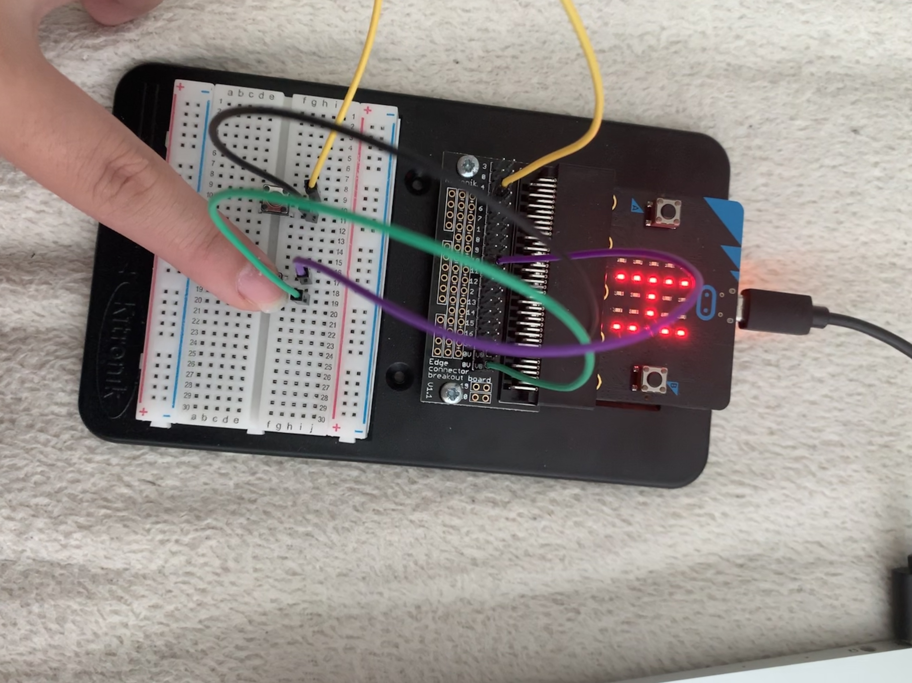
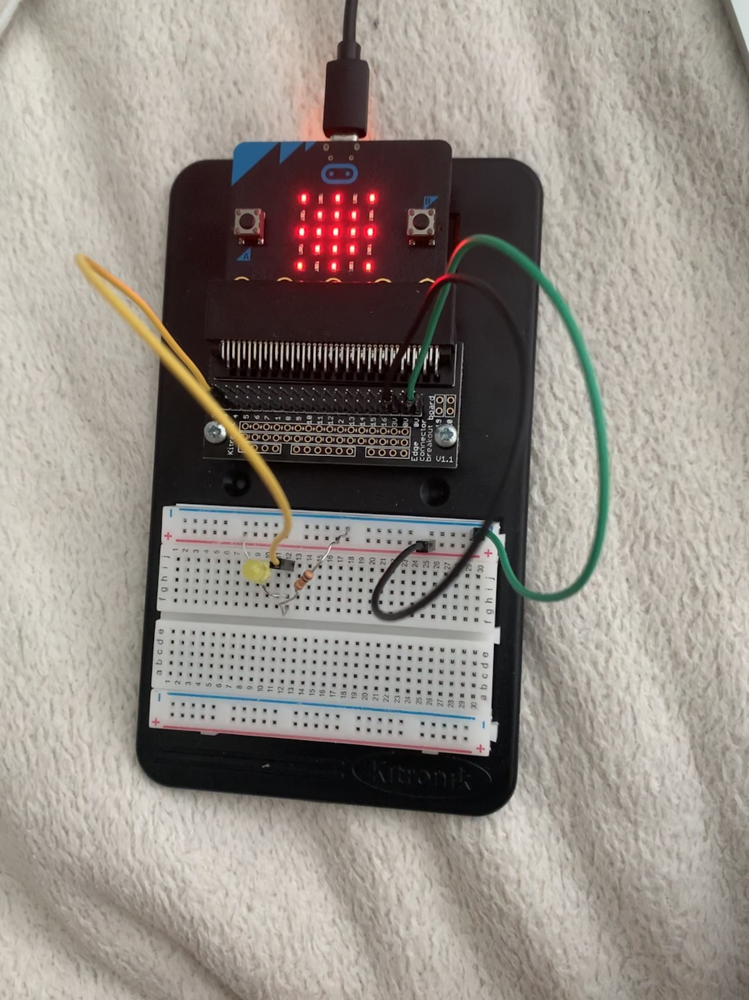
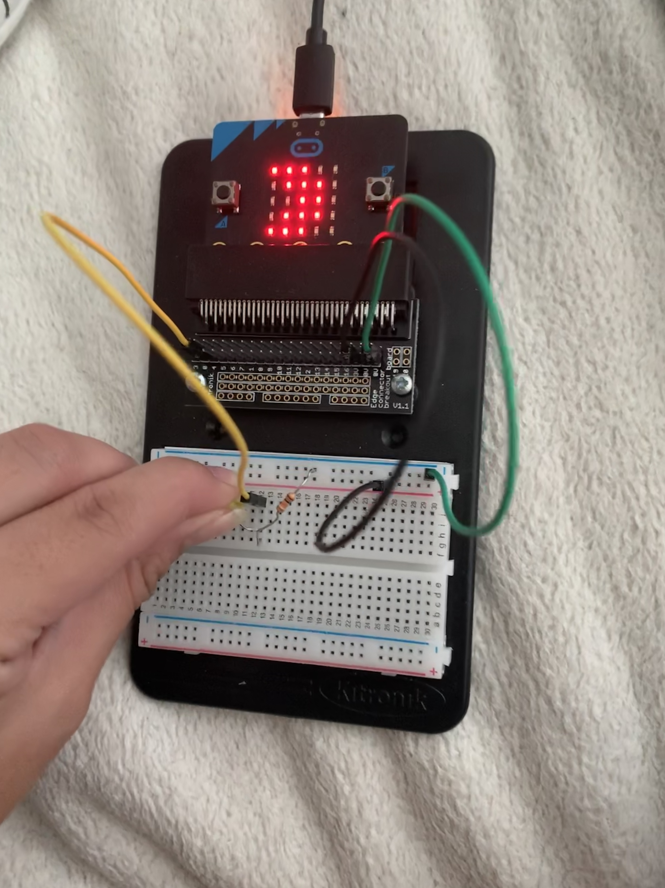
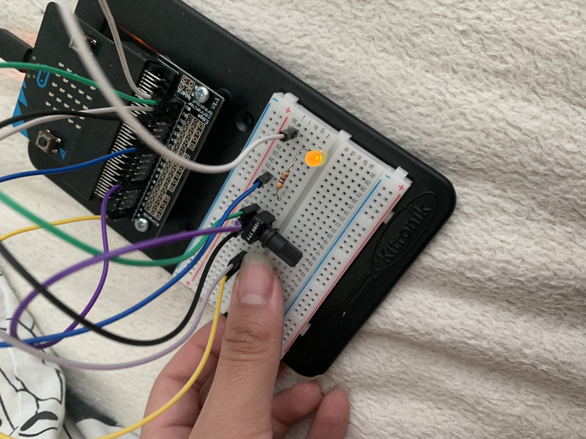
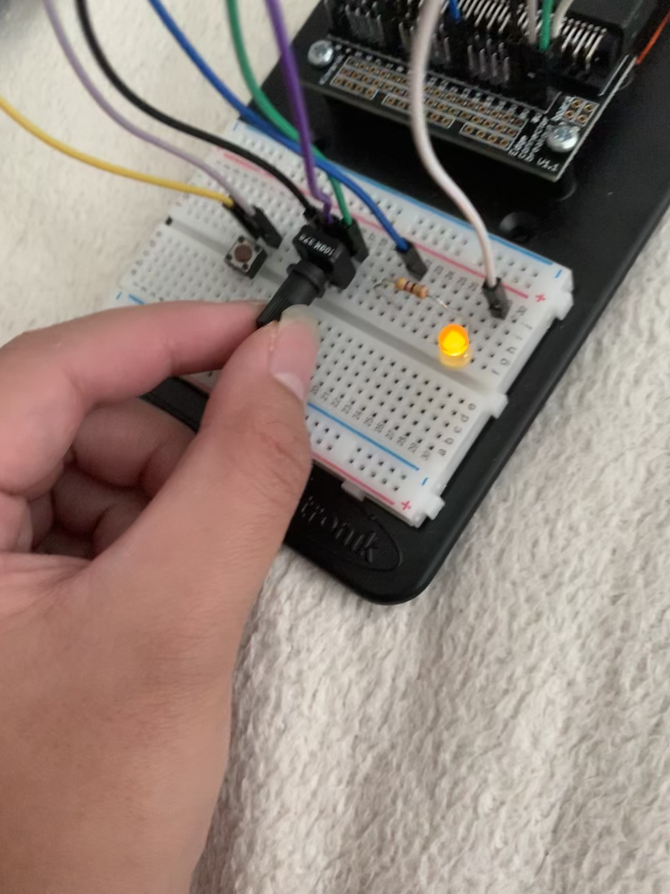
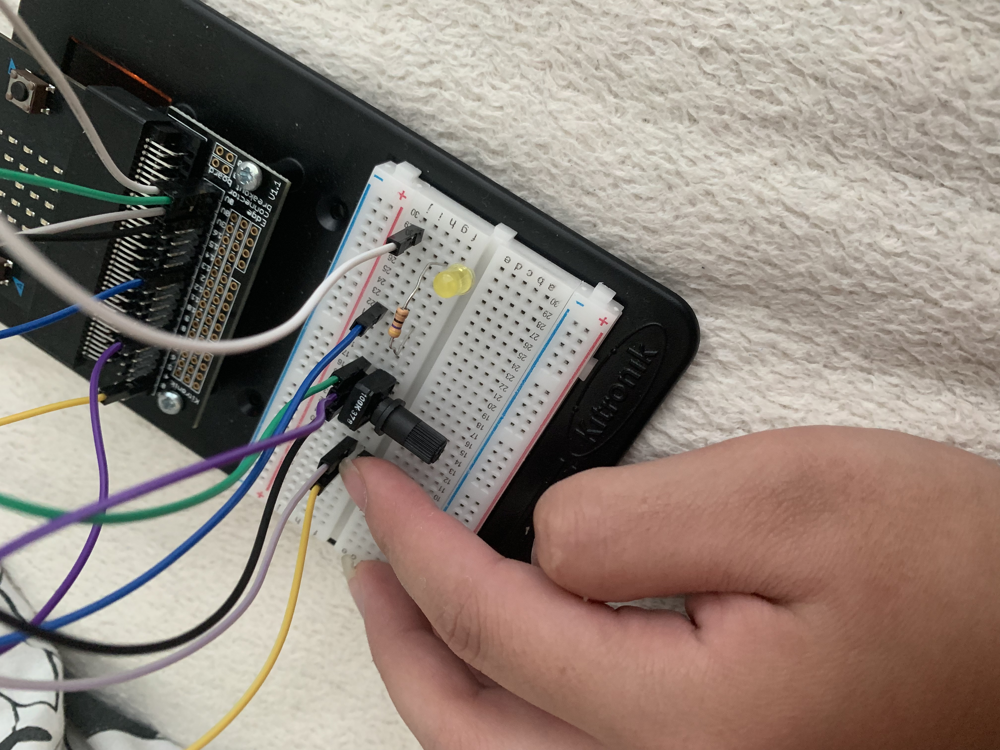
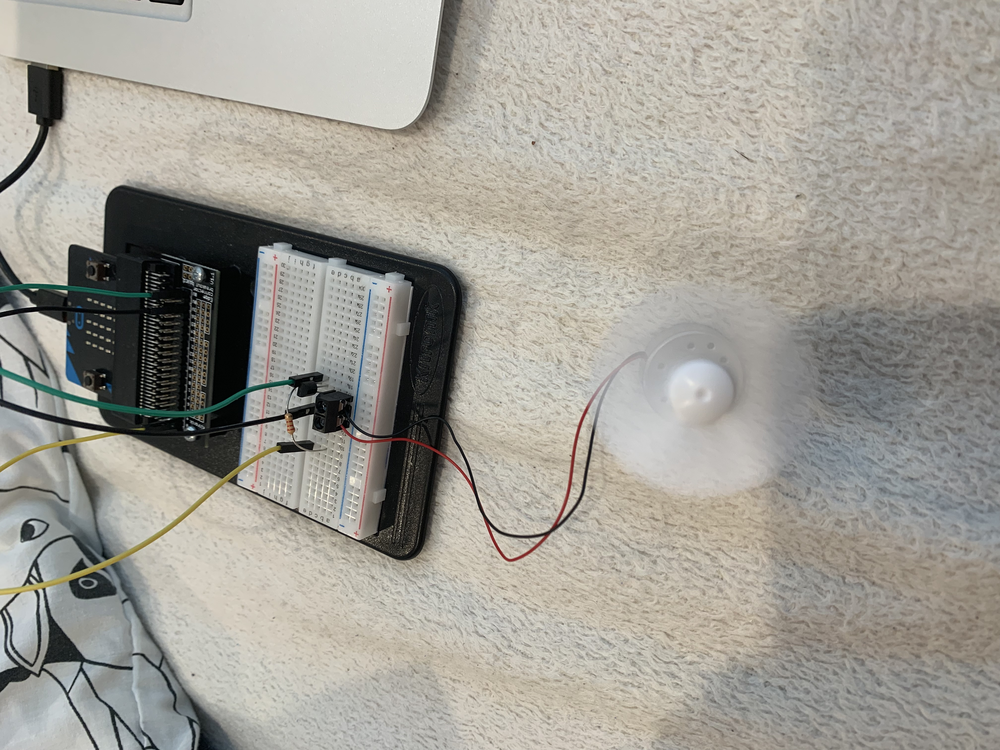
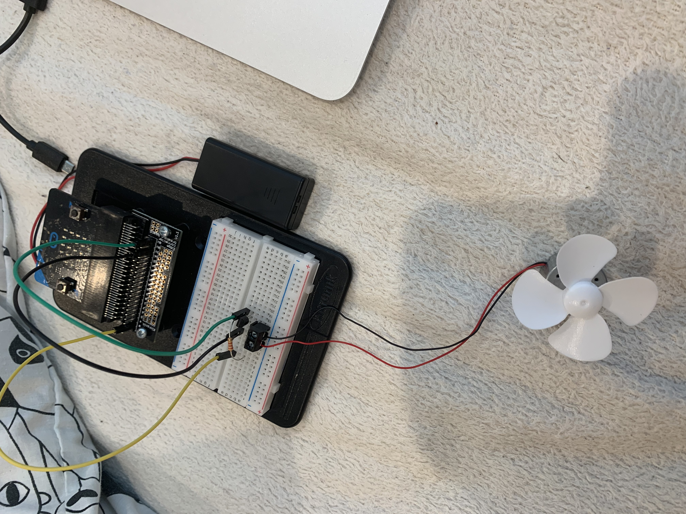
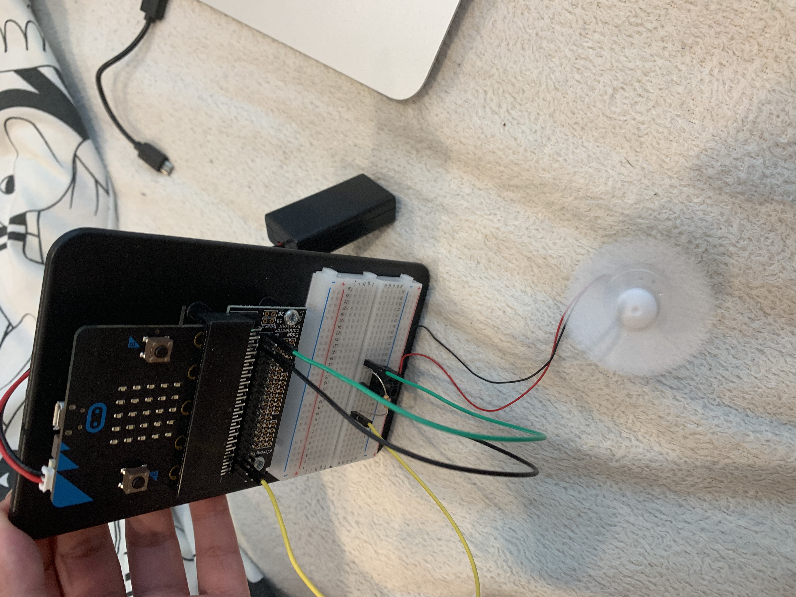

# Inventor Kit Experiments

*Markdown reference: https://guides.github.com/features/mastering-markdown/*

### Experiment 1 - Say Hello to the BBC Micro:bit ###

#### Photo of completed project ####

(The first image shows a smile when the left button is pushed and the second image shows 'hello' when the right button is pushed)

#### Reflection ####

In this experiment, something new to me was or something I learned was the basic functions of how the BBC microbit functioms.I had never really done coding or programming before so this was completely new to me. After doing this experiment though I was starting to get a grasp of things. 

This experiment could be the basis of a real world application such as simply having a doorbell attached to a screen above it that welcomes you before you enter through the door.

### Experiment 2 - Using a light sensor & analog inputs ###

#### Photo of completed project ####

(The first image shows a sun due to brightness, the second image shows a moon when the phototransitor is in darkness)

#### Reflection ####

In this experiment, something new to me was or something I learned was how the phototransitor works with light and dark. It was interesting to test out and see that the image on the microbit changes whether light is exposed to it or not. 

This experiment could be the basis of a real world application such as having lights that slowly start increasing their brightness as the sun goes down. You could be able to program the settings so only certain lights turn on. 

### Experiment 3 - Dimming an LED using a potentiometer ###

#### Photo of completed project ####

(The first image shows the light on. The second image shows the light is brighter after the potentiometer is turned. The third image shows the light off once the button is pushed)

#### Reflection ####

In this experiment, something new to me was or something I learned was using a potentiometer. It was interesting learning how a basic dimmer switch works and how I could create my own.

This experiment could be the basis of a real world application such as improving perfume bottles by using a potentiometer to determine how much or how little perfume you would like to dispense, with a bright green light showing optimal perfume levels and dimming as you change the dispenser. Pushing the button would then cause the perfume bottle to spray. 

### Experiment 4 - Using a transistor to driev a motor ###

#### Photo of completed project ####

(The image shows the fan functioning)

#### Reflection ####

In this experiment, something new to me was or something I learned was seeing how simple it is to actually make a motor run and, in this instance, make a fan move. I had thought basic motor function was more complicated, but after this experiment I have a deeper understanding of the funcction of the small motor. 

This experiment could be the basis of a real world application such as a rotating sponge on a waterproof-encased motor. Having a small motor powered by the microbit could reduce the amount of effort used to clean dishes. This could be potentially helpful for people who find it difficult to scrub a lot of dishes or use force with the sponge. 

### Experiment 5 - Using the accelerometer to control motor speed ###

#### Photo of completed project ####

(The first image shows the fan not in motion as the microbit is flat. The second image shows the fan functioning now that the microbit is vertical)

#### Reflection ####

In this experiment, something new to me was or something I learned was how the position and angle of the microbit can effectively control the speed of the fan. It was interesting having a different component control the fan instead of just a switch. 

This experiment could be the basis of a real world application such as upgrading a Spirit Leveler to include a motor into it. When the bubble is in the middle, indicating the item is straight, a pencil could then faintly mark the wall/material to ensure they know where the straight line is. 
