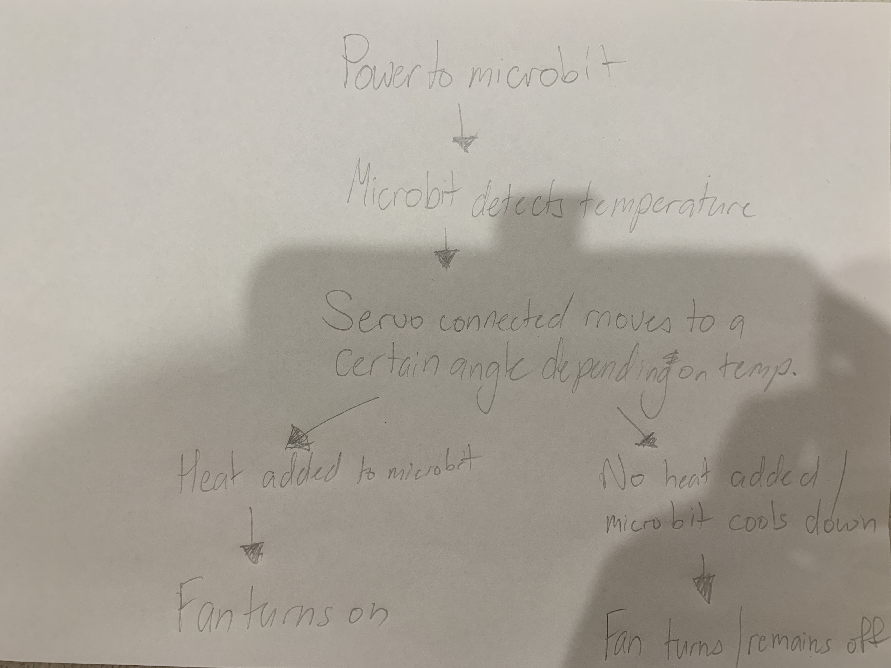
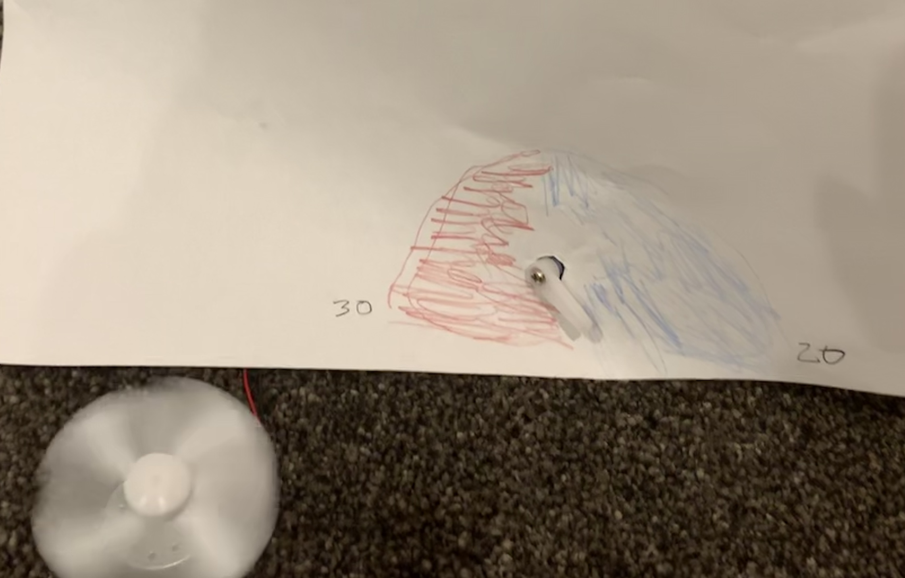

# Assessment 1: Replication project

*Markdown reference:* [https://guides.github.com/features/mastering-markdown/](http://guides.github.com/features/mastering-markdown/)

## Replication project choice - Temperature Gauge ##

## Related projects ##

### Related project 1 ###
Coronavirus Doorbell

(https://create.arduino.cc/projecthub/roni-bandini/coronavirus-doorbell-114b3f?ref=tag&ref_id=temperature&offset=0)

This project is related to mine because it also relates to temperature, but instead of having a servo and motor, an alarm sound goes off.

### Related project 2 ###
Temperature-controlled RGB LED

(https://create.arduino.cc/projecthub/ben/temperature-controlled-rgb-led-6c8cdf?ref=tag&ref_id=temperature&offset=23)

This project is related to mine because it is also temerature controlled device. Instead of turning a fan on, it turns on an LED; this is a similar function to mine. 

### Related project 3 ###
Temperature/Humidity Sensor

(https://create.arduino.cc/projecthub/techno_z/dht11-temperature-humidity-sensor-98b03b?ref=tag&ref_id=temperature&offset=14)

This project is related to mine because this is a temperature sensor that can inform the user of the temperature that, instead of a fan, the source is reading and display it on a separate screen. 

### Related project 4 ###
Indoor NeoPixel Thermometer

(https://create.arduino.cc/projecthub/hackerEsk/indoor-neopixel-thermometer-64f22e?ref=tag&ref_id=temperature&offset=57)

This project is related to mine because it changes the neopixel stick colour depending on the temperature that is being read by a separate device.

### Related project 5 ###
Pool Temperature Sensor

(https://core-electronics.com.au/projects/pool-temperature-sensor)

This project is related to mine because it uses an external sensor that can test the temperature of the water. The reading is then displayed on a separate LCD screen.

## Reading reflections ##
*Reflective reading is an important part of actually making your reading worthwhile. Don't just read the words to understand what they say: read to see how the ideas in the text fit with and potentially change your existing knowledge and maybe even conceptual frameworks. We assume you can basically figure out what the readings mean, but the more important process is to understand how that changes what you think, particularly in the context of your project.*

*For each of the assigned readings, answer the questions below.*

### Reading: Don Norman, The Design of Everyday Things, Chapter 1 (The Psychopathology of Everyday Things) ###

*What I thought before: Describe something that you thought or believed before you read the source that was challenged by the reading.*

*What I learned: Describe what you now know or believe as a result of the reading. Don't just describe the reading: write about what changed in YOUR knowledge.*

*What I would like to know more about: Describe or write a question about something that you would be interested in knowing more about.*

*How this relates to the project I am working on: Describe the connection between the ideas in the reading and one of your current projects or how ideas in the reading could be used to improve your project.*

### Reading: Chapter 1 of Dan Saffer, Microinteractions: Designing with Details, Chapter 1 ###

*What I thought before: Describe something that you thought or believed before you read the source that was challenged by the reading.*

*What I learned: Describe what you now know or believe as a result of the reading. Don't just describe the reading: write about what changed in YOUR knowledge.*

*What I would like to know more about: Describe or write a question about something that you would be interested in knowing more about.*

*How this relates to the project I am working on: Describe the connection between the ideas in the reading and one of your current projects or how ideas in the reading could be used to improve your project.*

### Reading: Scott Sullivan, Prototyping Interactive Objects ###

*What I thought before: Describe something that you thought or believed before you read the source that was challenged by the reading.*

*What I learned: Describe what you now know or believe as a result of the reading. Don't just describe the reading: write about what changed in YOUR knowledge.*

*What I would like to know more about: Describe or write a question about something that you would be interested in knowing more about.*

*How this relates to the project I am working on: Describe the connection between the ideas in the reading and one of your current projects or how ideas in the reading could be used to improve your project.*

## Interaction flowchart ##

## Process documentation

*In this section, include text and images that represent the development of your project including sources you've found (URLs and written references), choices you've made, sketches you've done, iterations completed, materials you've investigated, and code samples. Use the markdown reference for help in formatting the material.*

*This should have quite a lot of information!*

*There will likely by a dozen or so images of the project under construction. The images should help explain why you've made the choices you've made as well as what you have done. Use the code below to include images, and copy it for each image, updating the information for each.*

*Include screenshots of the code you have used.*

## Project outcome ##
### TEMPERATURE GAUGE ###

### Project description ###
This is a basic temperature gauge, where it can read the outside temperature and show you on a rough gauge using a servo arm. If the temperature reaches over 28 degrees celcius, the fan is then automatically turned on. This is a great indicator for when items get too hot. This would be great for electronic developers/builders. For example, if they build a robot that has many interactive functions, the electronics would then get too hot and ruin the robot. However, having a temperature gauge and then attaching an automatically triggered fan would rectify that, as the fan can immediately trigger before the robot overheats. 

### Showcase image ###

### Additional view ###

### Reflection ###
I felt that the most successful part of my project was getting the fan to be triggered by a certain temperature that the microbit's sensor picks up. I believe that I had the correct code, and the wiring setup seemed correct; however I could not seem to get the servo moving smoothly or well. The servo kept moving very randomly and didn't seem to really display the rough temperature that the microbit was reading. After warming up the microbit, it also took a long time before the servo's arm actually turned over 90 degrees. Originally, my project was going to just be the temperature gauge, but to make it more interesting I attached the fan as well and made it trigger after the microbit detected a certain temperature. 

*What techniques, approaches, skills, or information did you find useful from other sources (such as the related projects you identified earlier)?*

*What ideas have you read, heard, or seen that informed your thinking on this project? (Provide references.)*

This temperature gauge could be used on a bigger, more detailed scale.  LED lights could be attached as well. Onced the fan is activated, the light could turn on/red to indicate that the system/item is getting too hot and needs to be cooled down. Once the temperature decreases, the fan would turn off and the light could turn off/green to say the system/item will not overheat. This would be handy for laptops espeically, as they can overheat quickly without the user really knowing.  
