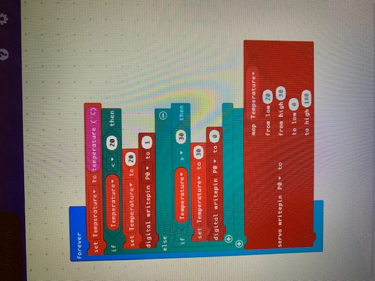
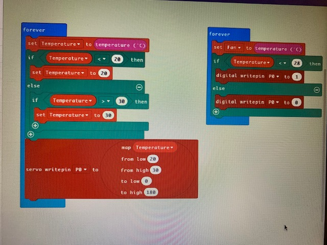

# Assessment 1: Replication project

*Markdown reference:* [https://guides.github.com/features/mastering-markdown/](http://guides.github.com/features/mastering-markdown/)

## Replication project choice - Temperature Gauge ##

## Related projects ##

### Related project 1 ###
Coronavirus Doorbell

(https://create.arduino.cc/projecthub/roni-bandini/coronavirus-doorbell-114b3f?ref=tag&ref_id=temperature&offset=0)

This project is related to mine because it also relates to temperature, but instead of having a servo and motor, an alarm sound goes off.

### Related project 2 ###
Temperature-controlled RGB LED

(https://create.arduino.cc/projecthub/ben/temperature-controlled-rgb-led-6c8cdf?ref=tag&ref_id=temperature&offset=23)

This project is related to mine because it is also temerature controlled device. Instead of turning a fan on, it turns on an LED; this is a similar function to mine. 

### Related project 3 ###
Temperature/Humidity Sensor

(https://create.arduino.cc/projecthub/techno_z/dht11-temperature-humidity-sensor-98b03b?ref=tag&ref_id=temperature&offset=14)

This project is related to mine because this is a temperature sensor that can inform the user of the temperature that, instead of a fan, the source is reading and display it on a separate screen. 

### Related project 4 ###
Indoor NeoPixel Thermometer

(https://create.arduino.cc/projecthub/hackerEsk/indoor-neopixel-thermometer-64f22e?ref=tag&ref_id=temperature&offset=57)

This project is related to mine because it changes the neopixel stick colour depending on the temperature that is being read by a separate device.

### Related project 5 ###
Pool Temperature Sensor

(https://core-electronics.com.au/projects/pool-temperature-sensor)

This project is related to mine because it uses an external sensor that can test the temperature of the water. The reading is then displayed on a separate LCD screen.

## Reading reflections ##

### Reading: Don Norman, The Design of Everyday Things, Chapter 1 (The Psychopathology of Everyday Things) ###
What I thought before: I didn't realise how important experience truly was for interaction. I obviously knew interaction was important, for example an engaging museum where you can touch the displays and make them come to life; however I didn't know that something as simple as the feel of a light-switch was also thought of in the interaction.

What I learned: How emotion and cognition really effects the interaction between user and experience. I don't nornmally associate emotion with interactive experiences, and if I do it is usually something negative that somone may want to avoid doing. But combining both can help the person develop a positive interaction with that experience and change the way they look at it. 

What I would like to know more about: How does conceptual models help designs, experiences and interactions that are supposed to make you think? Is it just mapped differently or is it completely omitted?

How this relates to the project I am working on: I believe this relates to my project as there is the aesthetic experience for the project that can attract a person to the interaction.

### Reading: Chapter 1 of Dan Saffer, Microinteractions: Designing with Details, Chapter 1 ###

What I thought before: I didn't think microinteractions were the design. I thought they were two different things that just existed alongside each other. 

What I learned: That the experience of the microinteraction is more often than not expected to be there with the other features of the product that is used/purchased.

What I would like to know more about: Is there a way to make microinteractions link with each other without affecting their individual purposes?

How this relates to the project I am working on: My microinteraction is the fan that automatically turns on when the microbit reaches temperature X.

### Reading: Scott Sullivan, Prototyping Interactive Objects ###

What I thought before: That whenever a new technology is created, only the technology is changed and the basic platform remains relatively the same unless a major change in technology has been discovered.

What I learned: I had discoverd that the platform of the product is the base where the design of the newest technology is presented. I did not think the platform was all that important and wasn't aware how much it is constantly changing for each new technology.

What I would like to know more about: How can we survive without the digital control in the physical world? Is it more feasible to go back to the olden times when the technlogy was nowhere near as advanced?

How this relates to the project I am working on: My temperature gauge can improve on the current thermostats, changing the platform and giving users more control over it.  

## Interaction flowchart ##

## Process documentation
*In this section, include text and images that represent the development of your project including sources you've found (URLs and written references), choices you've made, sketches you've done, iterations completed, materials you've investigated, and code samples. Use the markdown reference for help in formatting the material.*

*There will likely by a dozen or so images of the project under construction. The images should help explain why you've made the choices you've made as well as what you have done. Use the code below to include images, and copy it for each image, updating the information for each.*

This was my original code without connecting the fan 

This was my final code after programming the fan to automatically turn on once a certain temperature is hit

This was my setup of the microbit and breadboard before I had hidden the components behind the paper. 

## Project outcome ##
### TEMPERATURE GAUGE ###

### Project description ###
This is a basic temperature gauge, where it can read the outside temperature and show you on a rough gauge using a servo arm. If the temperature reaches over 28 degrees celcius, the fan is then automatically turned on. This is a great indicator for when items get too hot. This would be great for electronic developers/builders. For example, if they build a robot that has many interactive functions, the electronics would then get too hot and ruin the robot. However, having a temperature gauge and then attaching an automatically triggered fan would rectify that, as the fan can immediately trigger before the robot overheats. 

### Showcase image ###

### Additional view ###

### Reflection ###
I felt that the most successful part of my project was getting the fan to be triggered by a certain temperature that the microbit's sensor picks up. I believe that I had the correct code, and the wiring setup seemed correct; however I could not seem to get the servo moving smoothly or well. The servo kept moving very randomly and didn't seem to really display the rough temperature that the microbit was reading. After warming up the microbit, it also took a long time before the servo's arm actually turned over 90 degrees. Originally, my project was going to just be the temperature gauge, but to make it more interesting I attached the fan as well and made it trigger after the microbit detected a certain temperature. This temperature gauge could be used on a bigger, more detailed scale.  LED lights could be attached as well. Onced the fan is activated, the light could turn on/red to indicate that the system/item is getting too hot and needs to be cooled down. Once the temperature decreases, the fan would turn off and the light could turn off/green to say the system/item will not overheat. This would be handy for laptops espeically, as they can overheat quickly without the user really knowing.  
